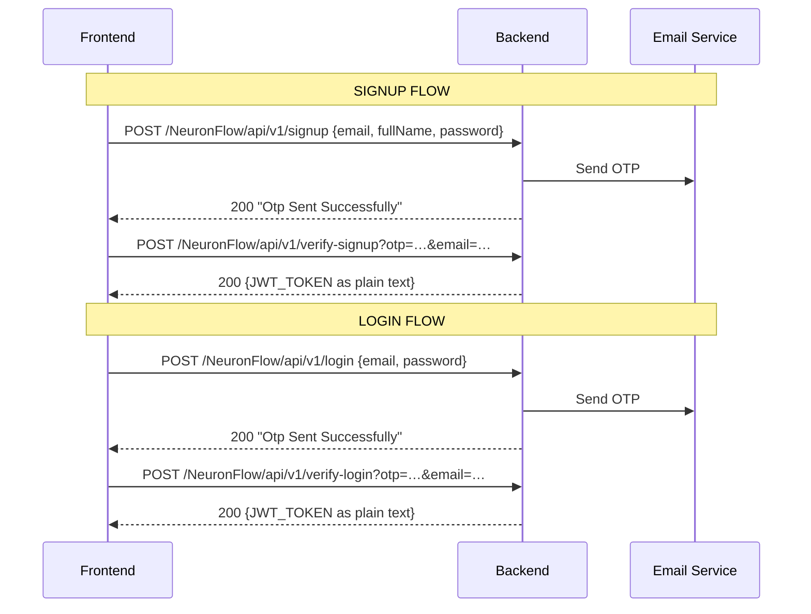
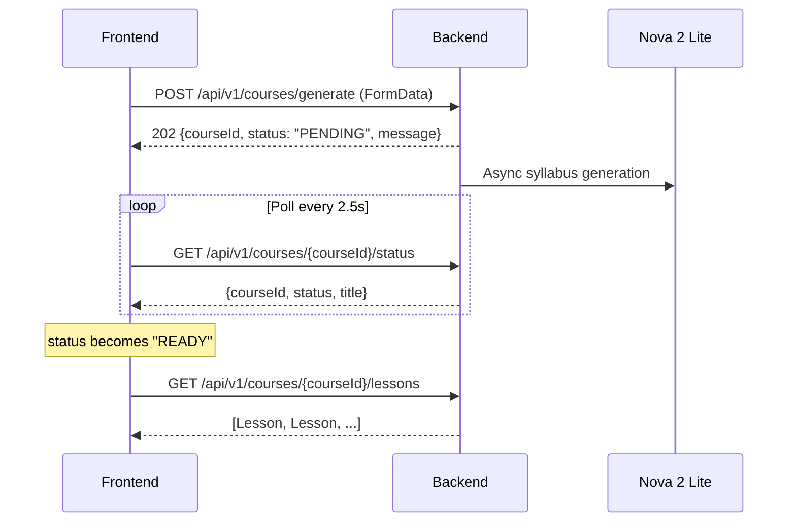
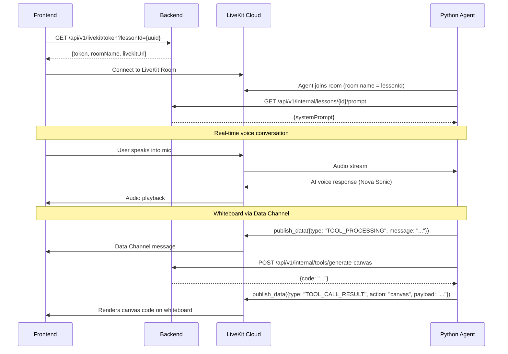

# NeuronFlow Backend API Documentation
## Complete Frontend Integration Guide

**Local URL:** `http://localhost:8080`  
**Auth Base Path:** `/NeuronFlow/api/v1`  
**API Base Path:** `/api/v1`

---

## Architecture Overview

```
┌──────────────┐       REST        ┌──────────────────┐     LiveKit      ┌─────────────────┐
│   React SPA  │ ◄───────────────► │  Java Spring Boot │ ◄──────────────► │  Python Agent   │
│  (Frontend)  │                   │   (Backend API)   │                  │  (Nova Sonic)   │
└──────────────┘                   └──────────────────┘                  └─────────────────┘
                                          │                                       │
                                     PostgreSQL                            LiveKit Cloud
                                       Redis                          (Voice + Data Channel)
```

- **Auth endpoints** use base path `/NeuronFlow/api/v1`
- **All other endpoints** use base path `/api/v1`
- **Voice sessions** use LiveKit (NOT WebSockets)
- **Whiteboard visuals** arrive via LiveKit Data Channel

---

## Table of Contents
1. [Authentication Flow](#1-authentication-flow)
2. [User Management](#2-user-management)
3. [Course Generation (Async)](#3-course-generation)
4. [Course Listing](#4-course-listing)
5. [LiveKit Voice Session](#5-livekit-voice-session)
6. [Quiz Generation](#6-quiz-generation)
7. [Media](#7-media)
8. [Data Models](#8-data-models)
9. [Error Handling](#9-error-handling)

---

# 1. Authentication Flow

All endpoints (except signup/login) require JWT token in header:
```
Authorization: Bearer {JWT_TOKEN}
```



### 1.1 Signup
**`POST /NeuronFlow/api/v1/signup`**

```json
{ "email": "user@example.com", "fullName": "John Doe", "password": "securePassword123" }
```
**Response:** `200 OK` → `"Otp Sent Successfully"`

### 1.2 Verify Signup
**`POST /NeuronFlow/api/v1/verify-signup?otp={otp}&email={email}`**

**Response:** `200 OK` → JWT token as plain text

### 1.3 Login
**`POST /NeuronFlow/api/v1/login`**

```json
{ "email": "user@example.com", "password": "securePassword123" }
```
**Response:** `200 OK` → `"Otp Sent Successfully"`

### 1.4 Verify Login
**`POST /NeuronFlow/api/v1/verify-login?otp={otp}&email={email}`**

**Response:** `200 OK` → JWT token as plain text

### 1.5 Reset Password
**`POST /NeuronFlow/api/v1/resetPassword`**

```json
{ "email": "user@example.com" }
```
**Response:** `200 OK` → `"Otp Sent Successfully"`

### 1.6 Verify Reset Password
**`POST /NeuronFlow/api/v1/verify-resetPassword?otp={otp}&email={email}&newPassword={newPassword}`**

**Response:** `200 OK` → `"Password Reset Successfully"`

---

# 2. User Management

### 2.1 Get Current User
**`GET /NeuronFlow/api/v1/me`** 🔒

**Response:** `200 OK`
```json
{
  "email": "user@example.com",
  "fullName": "John Doe",
  "profilePicture": "https://...",
  "availableToken": 1000,
  "createdAt": "2026-01-15T10:30:00",
  "stats": {
    "currentStreak": 5,
    "totalMinutesSpent": 3600,
    "lessonsCompleted": 12,
    "globalRank": 156,
    "weeklyGoalHours": 10,
    "lastActiveAt": "2026-02-01T14:00:00"
  }
}
```

### 2.2 Update Profile
**`PUT /NeuronFlow/api/v1/users/me`** 🔒

```json
{
  "base64Image": "data:image/png;base64,iVBORw0KGgo...",
  "weeklyGoalHours": 15
}
```
> Both fields are optional.

**Response:** `200 OK` → `"Profile Updated Successfully"`

---

# 3. Course Generation

The course generation flow uses **202 Accepted** with **polling**.



### 3.1 Generate Course
**`POST /api/v1/courses/generate`** 🔒

**Content-Type:** `multipart/form-data`

| Field | Type | Required | Description |
|-------|------|----------|-------------|
| `learningMode` | String | ✅ | `TOPIC`, `DOCUMENT`, or `VIDEO` |
| `targetLanguage` | String | ✅ | e.g. `"English"`, `"French"` |
| `topic` | String | Only for TOPIC | The topic to teach |
| `file` | File | Only for DOCUMENT/VIDEO | PDF or video file |

**Response:** `202 Accepted`
```json
{
  "courseId": "a1b2c3d4-...",
  "status": "PENDING",
  "message": "Course generation started asynchronously."
}
```

### 3.2 Poll Course Status
**`GET /api/v1/courses/{courseId}/status`** 🔒

**Response:** `200 OK`
```json
{
  "courseId": "a1b2c3d4-...",
  "status": "GENERATING",
  "title": "Introduction to Machine Learning"
}
```

**Status values:** `PENDING` → `GENERATING` → `READY` | `FAILED`

### 3.3 Get Course Lessons
**`GET /api/v1/courses/{courseId}/lessons`** 🔒

> Only works when course status is `READY`. Returns `400` otherwise.

**Response:** `200 OK`
```json
[
  {
    "id": "uuid-1",
    "orderIndex": 0,
    "title": "What is Machine Learning?",
    "objective": "Understand the fundamentals..."
  },
  {
    "id": "uuid-2",
    "orderIndex": 1,
    "title": "Supervised Learning",
    "objective": "Learn about supervised approaches..."
  }
]
```

---

# 4. Course Listing

### 4.1 Get All User Courses
**`GET /api/v1/courses`** 🔒

Returns all courses for the authenticated user, ordered by most recent first.

**Response:** `200 OK`
```json
[
  {
    "id": "uuid-...",
    "title": "Introduction to Machine Learning",
    "learningMode": "TOPIC",
    "targetLanguage": "English",
    "status": "READY",
    "lessons": [...],
    "createdAt": "2026-02-01T10:00:00"
  }
]
```

### 4.2 Get Recent Courses
**`GET /api/v1/courses/recent`** 🔒

Returns the 5 most recent courses for the authenticated user.

**Response:** Same shape as 4.1.

### 4.3 Get Course by ID
**`GET /api/v1/courses/{courseId}`** 🔒

**Response:** `200 OK` — Single `Course` object (same shape as list items).

---

# 5. LiveKit Voice Session

The lesson session uses **LiveKit** for real-time voice interaction with a Python AI agent (Amazon Nova Sonic).



### 5.1 Get LiveKit Token
**`GET /api/v1/livekit/token?lessonId={uuid}`** 🔒

**Response:** `200 OK`
```json
{
  "token": "eyJ...",
  "roomName": "a1b2c3d4-...",
  "livekitUrl": "wss://your-project.livekit.cloud"
}
```

### 5.2 Data Channel Payloads (Agent → Frontend)

**Processing state:**
```json
{ "type": "TOOL_PROCESSING", "message": "Generating visual code..." }
```

**Canvas result:**
```json
{ "type": "TOOL_CALL_RESULT", "action": "canvas", "payload": "<React code string>" }
```

**Image result:**
```json
{ "type": "TOOL_CALL_RESULT", "action": "image", "url": "/api/v1/media/image/{uuid}" }
```

---

# 6. Quiz Generation

### 6.1 Generate Quiz for Lesson
**`POST /api/v1/lessons/{lessonId}/generate-quiz`** 🔒

**Content-Type:** `multipart/form-data`

| Field | Type | Required | Description |
|-------|------|----------|-------------|
| `file` | File | ✅ | PDF document |
| `startPage` | int | ✅ | Start page number |
| `endPage` | int | ✅ | End page number |

**Response:** `200 OK`
```json
{ "message": "Quiz generated successfully" }
```

---

# 7. Media

### 7.1 Get Generated Image
**`GET /api/v1/media/image/{uuid}`** (No auth required)

**Response:** `200 OK` — Binary PNG image (`Content-Type: image/png`)

Returns `404` if the image has expired from Redis cache.

---

# 8. Data Models

## 8.1 Enums

```typescript
type LearningMode = "TOPIC" | "DOCUMENT" | "VIDEO";
type CourseStatus = "PENDING" | "GENERATING" | "READY" | "FAILED";
```

## 8.2 TypeScript Interfaces

```typescript
interface Course {
  id: string;           // UUID
  title: string;
  learningMode: LearningMode;
  targetLanguage: string;
  status: CourseStatus;
  lessons: Lesson[];
  createdAt: string;    // ISO LocalDateTime
}

interface Lesson {
  id: string;           // UUID
  orderIndex: number;
  title: string;
  objective: string;
}

interface UserDTO {
  email: string;
  fullName: string;
  profilePicture: string | null;
  availableToken: number;
  createdAt: string;
  stats: UserLearningStatsDTO;
}

interface UserLearningStatsDTO {
  currentStreak: number;
  totalMinutesSpent: number;
  lessonsCompleted: number;
  globalRank: number;
  weeklyGoalHours: number;
  lastActiveAt: string;
}

interface LiveKitTokenResponse {
  token: string;
  roomName: string;
  livekitUrl: string;
}

interface CourseGenerateResponse {
  courseId: string;
  status: CourseStatus;
  message: string;
}

interface CourseStatusResponse {
  courseId: string;
  status: string;
  title: string;
}

interface WhiteboardPayload {
  type: "TOOL_PROCESSING" | "TOOL_CALL_RESULT";
  action?: "image" | "canvas";
  url?: string;
  payload?: string;
  message?: string;
}
```

---

# 9. Error Handling

## HTTP Status Codes

| Code | Meaning |
|------|---------|
| `200` | Success |
| `202` | Accepted (async course generation started) |
| `400` | Bad Request (validation error, course not ready) |
| `401` | Unauthorized (missing/invalid token) |
| `403` | Forbidden |
| `404` | Not Found |
| `409` | Conflict (user already exists) |
| `413` | Payload Too Large (file > 50MB) |
| `500` | Internal Server Error |

## Error Response Format

```json
{
  "timestamp": "2026-03-09T21:44:00",
  "status": 400,
  "error": "Bad Request",
  "message": "Course is not ready yet.",
  "path": "/api/v1/courses/{id}/lessons"
}
```

---

## Quick Reference Card

| Action | Method | Full Path |
|--------|--------|-----------|
| Signup | POST | `/NeuronFlow/api/v1/signup` |
| Verify Signup | POST | `/NeuronFlow/api/v1/verify-signup` |
| Login | POST | `/NeuronFlow/api/v1/login` |
| Verify Login | POST | `/NeuronFlow/api/v1/verify-login` |
| Reset Password | POST | `/NeuronFlow/api/v1/resetPassword` |
| Verify Reset | POST | `/NeuronFlow/api/v1/verify-resetPassword` |
| Get Current User | GET 🔒 | `/NeuronFlow/api/v1/me` |
| Update Profile | PUT 🔒 | `/NeuronFlow/api/v1/users/me` |
| Generate Course | POST 🔒 | `/api/v1/courses/generate` |
| Poll Status | GET 🔒 | `/api/v1/courses/{id}/status` |
| Get Lessons | GET 🔒 | `/api/v1/courses/{id}/lessons` |
| List Courses | GET 🔒 | `/api/v1/courses` |
| Recent Courses | GET 🔒 | `/api/v1/courses/recent` |
| Get Course | GET 🔒 | `/api/v1/courses/{id}` |
| LiveKit Token | GET 🔒 | `/api/v1/livekit/token` |
| Generate Quiz | POST 🔒 | `/api/v1/lessons/{id}/generate-quiz` |
| Get Image | GET | `/api/v1/media/image/{uuid}` |

🔒 = Requires `Authorization: Bearer {token}` header

---

## Internal Endpoints (Python Agent → Backend)

These are called by the Python LiveKit agent, **not** the frontend:

| Action | Method | Path |
|--------|--------|------|
| Get Lesson Prompt | GET | `/api/v1/internal/lessons/{id}/prompt` |
| Generate Canvas Code | POST | `/api/v1/internal/tools/generate-canvas` |
| Generate Image | POST | `/api/v1/internal/tools/generate-image` |

---

*Documentation updated: March 9, 2026*  
*Backend Version: Spring Boot 3.5.9*
